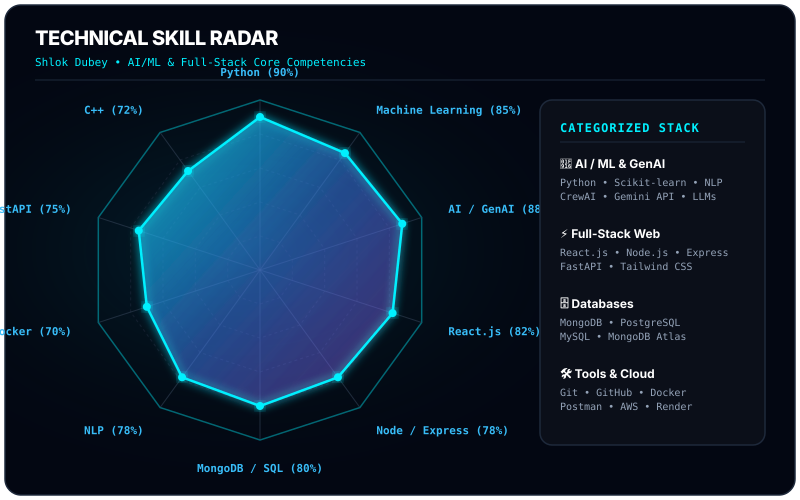
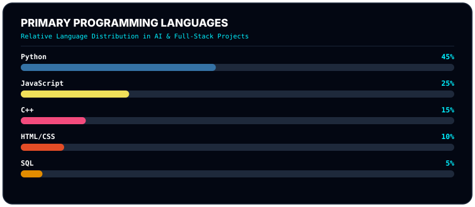
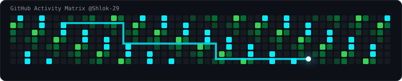

<!-- HERO TABLE / LAYOUT -->
<table border="0" width="100%" style="border: none; background: transparent;">
  <tr>
    <td width="58%" valign="top" style="border: none;">
      
# Hi 👋, I'm Shlok Dubey

### AI/ML Engineer • Full-Stack Developer • Student Leader

  

  
  
  
  

  
  
  

    </td>
    <td width="42%" align="center" valign="middle" style="border: none;">
      
    </td>
  </tr>
</table>

---

## 🚀 About Me

I'm **Shlok Dubey**, a Computer Science Engineering (AI & ML) student at IES University passionate about building production-ready intelligent systems, autonomous multi-agent workflows, and scalable full-stack applications.

Currently serving as **Vice President of the Student Council**, I enjoy combining technological innovation, team leadership, and rapid execution to build software products with real-world impact.

### 🎯 Key Focus Areas

* 🤖 **Artificial Intelligence & Machine Learning**: Autonomous agents, predictive modeling & NLP
* ⚡ **Generative AI & LLMs**: CrewAI orchestration, Gemini API integration, and prompt engineering
* 💻 **Full-Stack Development**: Modern React/Next.js interfaces, FastAPI microservices, and Node.js REST APIs
* ☁️ **Cloud & Infrastructure**: Distributed systems, containerization (Docker), and cloud deployments
* 🏆 **Hackathons & Leadership**: Top finalist in national hackathons & student council executive leadership

---

## 💻 Tech Stack & Arsenal

### Languages

  
  
  
  
  

### AI / ML & Frameworks

  
  
  
  
  

### Frontend & Backend

  
  
  
  
  
  

### Databases & Cloud Tools

  
  
  
  
  
  

---

## 📊 Technical Skill Radar

  

  

---

## 🚀 Featured Projects

### 🔗 [ChainMind](https://github.com/Shlok-29/Chain_Mind)
> **Autonomous Multi-Agent Supply Chain Orchestration**
* An AI-powered platform leveraging collaborating autonomous agents (demand, procurement, logistics) to optimize supply chain workflows and automate decision-making.
* **Tech Stack:** React • TypeScript • FastAPI • CrewAI • Streamlit • Machine Learning
* [View Repository ➔](https://github.com/Shlok-29/Chain_Mind)

---

### 💰 [FinCash](https://github.com/Shlok-29/FinCash)
> **AI Financial Literacy Platform for First-Time Earners**
* An AI financial mentor and interactive simulator helping users master budgeting, investments, tax planning, and market simulations.
* **Tech Stack:** React • Node.js • MongoDB • FastAPI • Gemini API
* [View Repository ➔](https://github.com/Shlok-29/FinCash)

---

### 📚 [StudySpace](https://github.com/Shlok-29/Studyspace)
> **AI-Powered Collaborative Learning Ecosystem**
* A high-performance digital study room platform enhancing student focus through real-time WebSockets, shared whiteboards, and AI tutoring.
* **Tech Stack:** Next.js • PostgreSQL • Docker • Socket.io • Tailwind CSS
* [View Repository ➔](https://github.com/Shlok-29/Studyspace)

---

## 🐍 GitHub Contribution Calendar

  

---

## 📈 GitHub Analytics & Streak

  
  

  

---

## 💼 Leadership & Experience

* 🏛️ **Vice President — Student Council (IES University)**
  * Leading student body operations, directing cross-functional technical teams, and managing campus symposiums.
* 🌍 **Junior Manager — AIESEC in Bhopal**
  * Managed international exchange candidate onboarding, supported 50+ participants, and spearheaded the Youth Speak Forum.

---

## 🏆 Achievements & Certifications

* 🥇 **Udbhav'26 — Top 10 Grand Finalist**: Selected among top 10 innovation teams out of 300+ entries nationwide.
* ⚡ **TIT Srijan 2026 — National Hackathon Finalist**: Reached national finals during a 36-hour hackathon.
* 🎤 **Event Head — INFORIA 2024 & 2025**: Led organizing committee for flagship tech fest hosting 1000+ attendees.
* 🎙️ **TEDx IES University Anchor**: Hosted keynote speakers at official TEDx conference.
* 📜 **JPMorgan Chase Software Engineering Simulation**: Completed practical tasks in financial UI visualization & performance.
* 📜 **Tata GenAI-Powered Data Analytics Simulation**: Built Generative AI data visualization workflows.
* 📜 **NPTEL Certification in Cloud Computing** (IIT Kharagpur)
* 📜 **NPTEL Certification in Internet of Things (IoT)** (IIT Kharagpur)
* 📜 **Letter of Excellence**: Awarded by AIESEC Bhopal for operational leadership.

---

## 🌐 Connect With Me

  
  
  

### 💻 Coding Profiles

* 💻 **LeetCode**: [leetcode.com/u/OZhLNdh8jK/](https://leetcode.com/u/OZhLNdh8jK/)
* 🏆 **HackerRank**: [hackerrank.com/profile/shlokdubey2903](https://www.hackerrank.com/profile/shlokdubey2903)
* ⚡ **HackerEarth**: [hackerearth.com/@shlokdubey2903/](https://www.hackerearth.com/@shlokdubey2903/)

---

  

